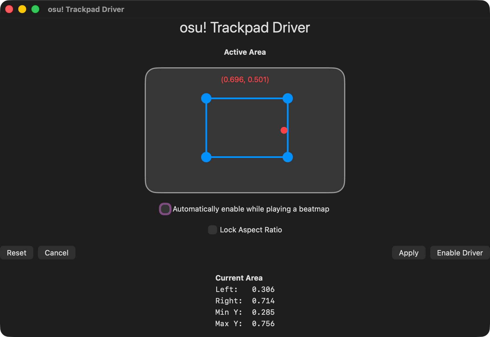

# Osu Trackpad Driver 



A app that allows your trackpad to have **absolute positioning** for playing osu!

## Features 
- A `.config` file so you can transfer your settings from one machine to another easily.
- Automatically detect and enable the driver when playing a beatmap
- Aspect Ratio Fixer so if you use a external monitor your trackpad will scale accordingly 

## Installation
### Using homebrew

``` bash
brew tap yahddyyp/tap
brew install --cask osu-thing
```

## Usage 
1. Just open the app (and give it the required permissions) and select your trackpad area you would like to use
2. Press apply and you are done 
3. To disable the driver just press disable driver in the app or `F8` on your keyboard

## Inspiration 
- https://github.com/EricPanDev/Mac-Trackpad-OSU-Tablet

This app is made by me, expect bugs

<p align="center"><a href="https://github.com/yahddyyp/osu-thing/blob/main/LICENSE"></a></p>
